# Abstract 
the evolution of computer vision over the years

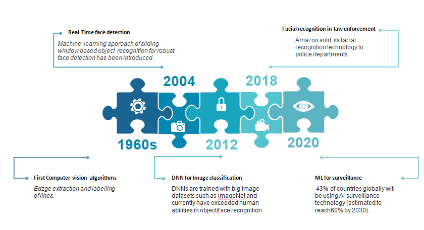

# Dependencies
- Python ( I used 3.8.2)
- opencv
- imutils
- stmplib 
- Flask

# AI-powered-surveillance-using-raspberry-pi
this projet aims to automate surveillance  using the Raspberry Pi computer and its camera module . This project was inspired by other older works and it's a push towards the AI-powered surveillance as computer vision and IoT are strongly emerging.
The main focuses of this project are efficiency and  accuracy .


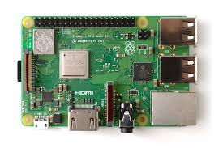

Here's the general Idea/architecture of the project :

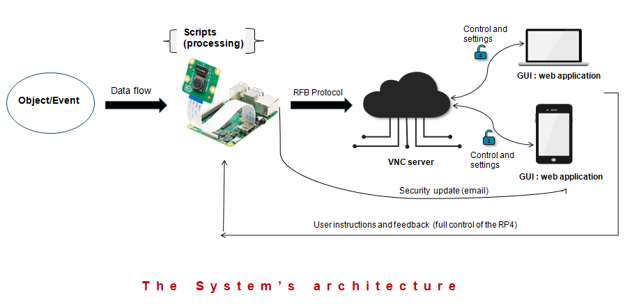

If we zoom in on the Raspberry Pi here's what's the script looks like :


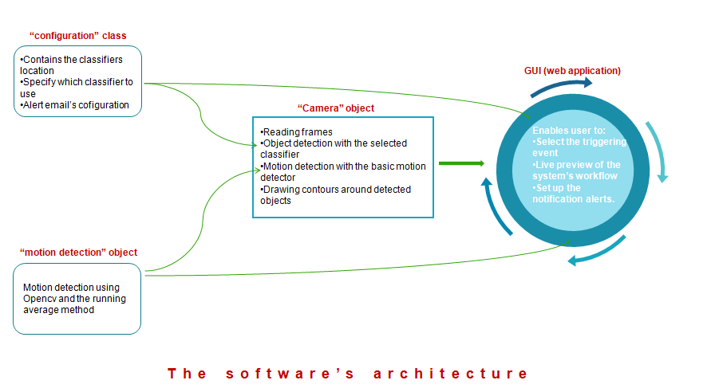

# Motion detection 
the motion detector is completely built using Opencv . It follows these basic steps (the last image is actually for contour and motion detection) :


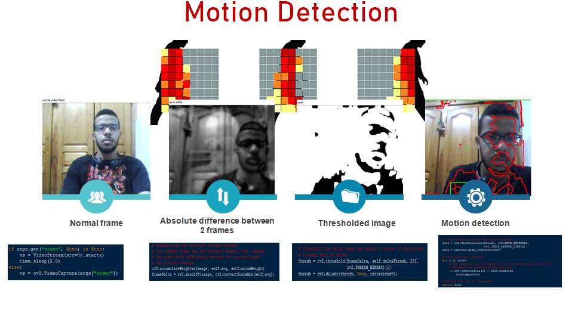

# Cascade Classifiers (for specific object detection)

To secifically detect objects I used cascade classification .
this classifiers will detect the object that will trigger the security camera .
Here's an overview concerning cascade classifiers : 

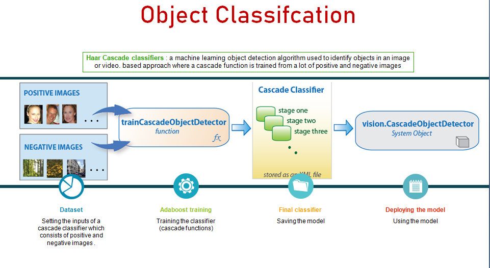

# The GUI ( Web-app)

The GUI that enables the user to intract with the camera and change the settings is developed using Flask :

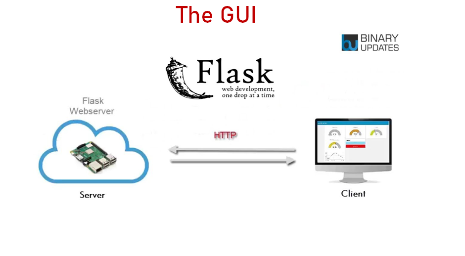
Here's how the GUI looks like with a live preview :

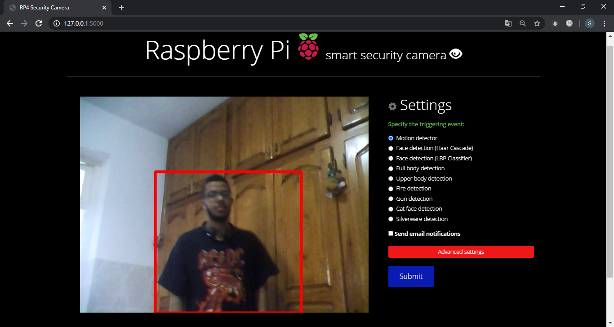

# The different options :

the user can specify one of many objects to trigger the security camera .Here are some examples : 
## face detection :
I used Haar cascade and LBP classifiers just to show the difference ( Haar cascade is more accurate but LBP is faster) : 


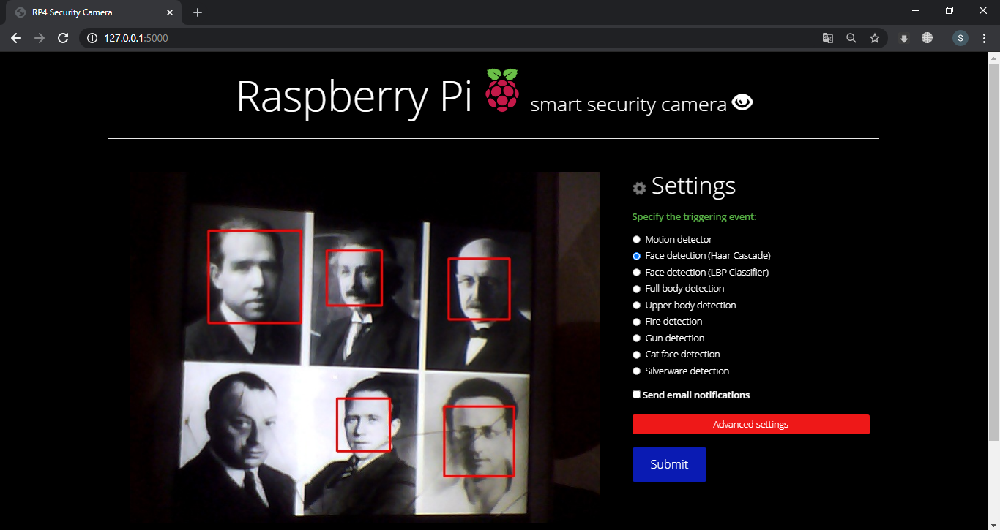

## gun detection : 


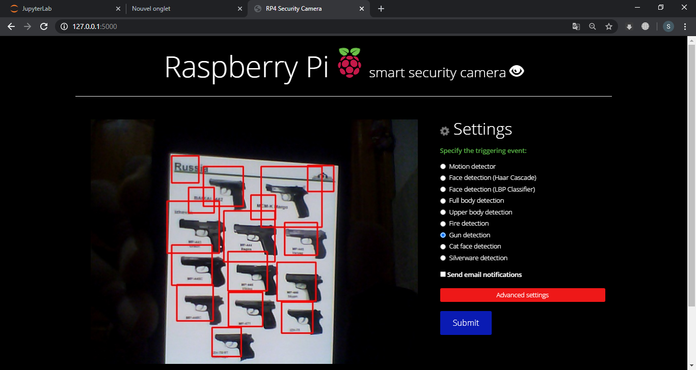

## fire detection : 


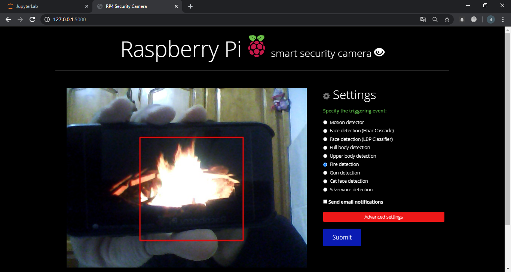

### Note : to view the selected classifier at work in real-time ; press on "advanced settings" and check 
- [x] enable live preview with object detection


## receiving the security alerts :

The GUI enables you to specify the sender and receiver adresses ( gmail only compatible as we are using smtp) : 

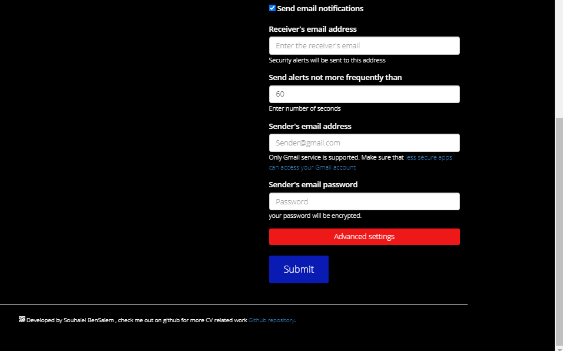

Here's how the security alert looks like :

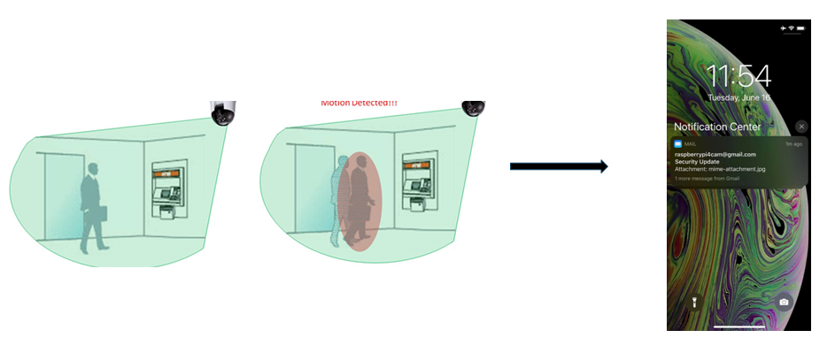

# How to run the project :

First of all code is adapted to the use of a usb camera , so if you're using the pi's camera module you have to make some small changes . 
I used the Raspberry Pi 4 modeb B with 2GB of RAM .
To install OpenCV on the pi , please refer Adrian's tutorial (pyimagesearch.com)
To control the Raspberry pi remotely to change settings and whatnot , install the VNC server on the pi , download VNC Viewer app for your Android or IOS device and create an account . This will enable you be fully in control wherever you are ; 
When everything is set , all you have to do is type these commad to launch the web app : 
```
source ~/.profile
workon cv
python app.py
```

#### Please note that I am kind of a beginner , so there's always room for improvement . Also thanks to everyone who's previous works inspired this project .
#### I'm very excited for what's to come . Cheers brothers!


